# OfflineNotesApp

OfflineNotesApp is a cross-platform Flutter-based Offline Notes Application designed to deliver a smooth and reliable note-taking experience with full offline capabilities and cloud synchronization. The application supports complete CRUD operations, allowing users to create, read, update, and delete notes efficiently. It is built with an offline-first approach, ensuring that users can continue using the app without any internet connection interruptions.

For local storage, the application uses **Hive**, a lightweight and fast NoSQL database for Flutter. Hive acts as the primary offline storage layer where all notes are stored instantly when created or modified. This ensures fast access, high performance, and seamless offline functionality. Any changes made by the user—such as creating, editing, or deleting notes—are first persisted in Hive and later synchronized with the remote server when connectivity is available.

The backend server is implemented using **MockAPI.io**, which simulates real REST API endpoints for handling notes data. The application communicates with MockAPI.io to perform all server-side operations such as fetching notes, creating new notes, updating existing notes, and deleting notes. This setup helps replicate a real-world backend environment while keeping the system lightweight and easy to manage.

Synchronization is a core feature of the application. It supports both manual and automatic sync mechanisms. Users can manually trigger synchronization using a sync button, or the system will automatically detect internet connectivity restoration and start syncing data. During sync, data flows bidirectionally—local Hive data is pushed to MockAPI.io, and remote updates from MockAPI.io are pulled back into Hive to ensure both sources remain consistent.

The application also includes a robust conflict handling system to manage data inconsistencies between local and server states. Since both Hive (offline storage) and MockAPI.io (server storage) can be updated independently, conflicts may arise when the same note is modified in multiple places. The app detects such conflicts and presents a resolution interface where users can choose between keeping the local version or the server version. Once resolved, the application refreshes the notes list to ensure consistency across both storage layers.

Edge cases such as simultaneous edits, deletions, and mismatched updates are also handled carefully. For example, if a note is edited locally but deleted on the server after the last sync, or if both the app and server modify or delete the same note simultaneously, the system intelligently identifies these scenarios and resolves them without data loss or inconsistency.

From an architectural standpoint, the project follows **Clean Architecture principles**, ensuring a highly scalable and maintainable codebase. The structure is divided into Data, Domain, and Presentation layers, each responsible for a specific concern. The Repository Pattern is used to abstract data sources such as Hive and MockAPI.io, while **BLoC (Business Logic Component)** is used for state management to ensure predictable and reactive UI updates. This separation of concerns makes the application easy to extend, test, and maintain.

Overall, this project represents a production-ready offline-first notes application with strong synchronization capabilities, conflict resolution mechanisms, and a clean modular architecture. It ensures that user data remains safe, consistent, and accessible across both offline and online environments, providing a seamless experience regardless of network conditions.

## Demo Video

[Watch the Demo on YouTube](https://www.youtube.com/watch?v=SQKchnyJvNY&t=17s)

[Download Demo Video](offlinenotesapp/assets/videos/demo_clip.mp4)

## Screenshots

### Syncing

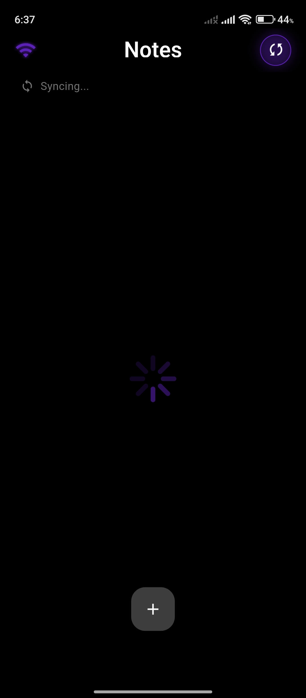

### After sync

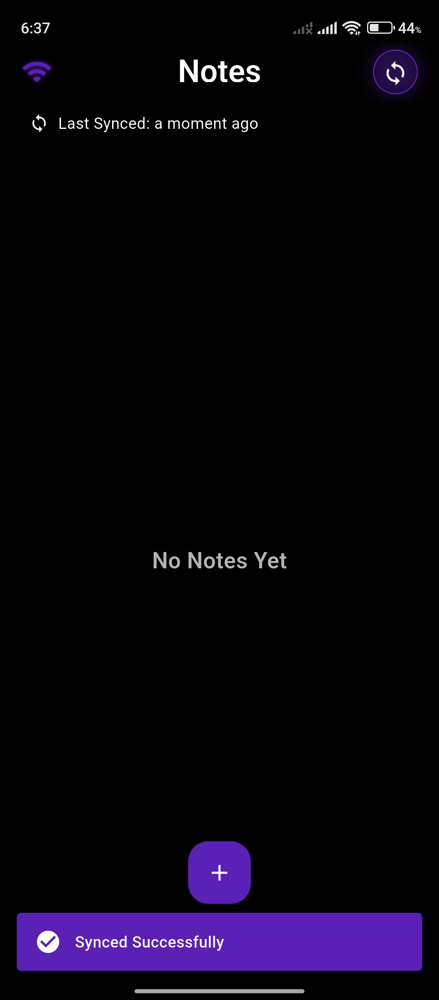

### Add note

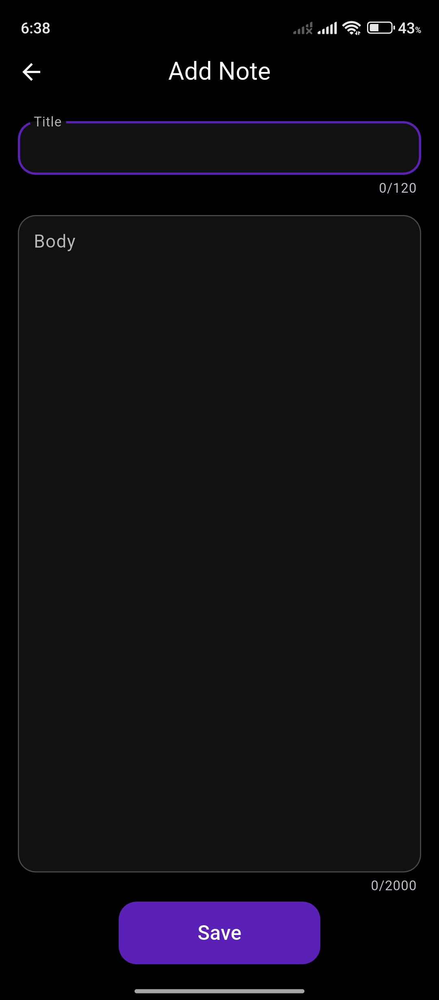

### Add note

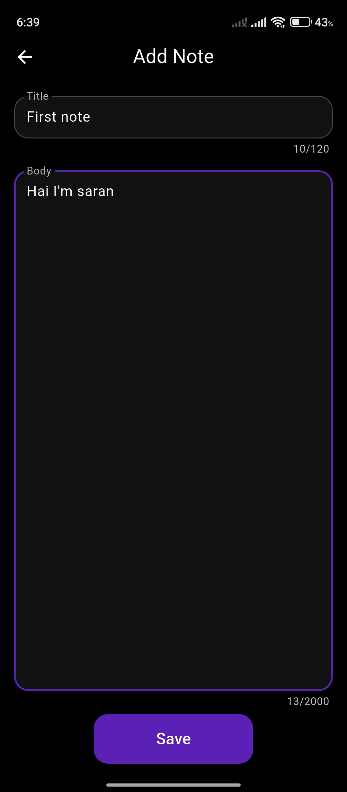

### Added note not Synced

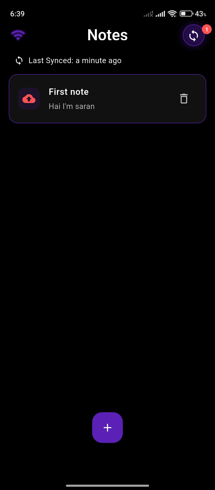

### Added note Synced

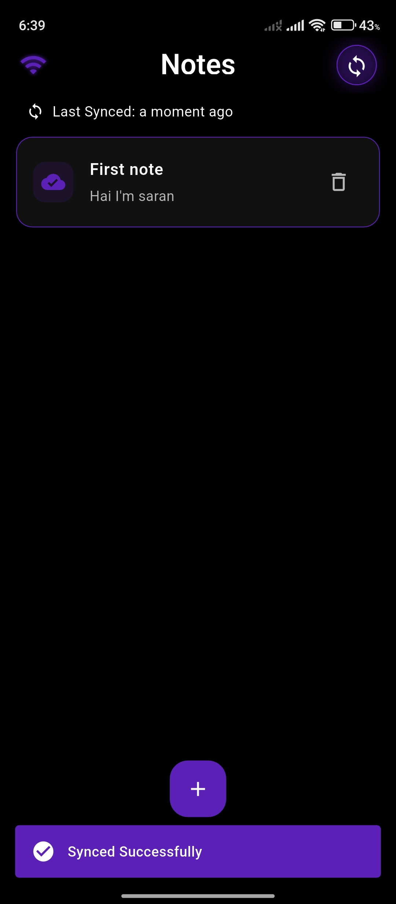

### Synced note from server

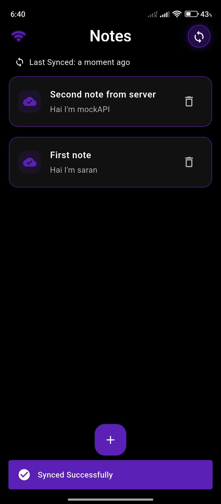

### Edit note

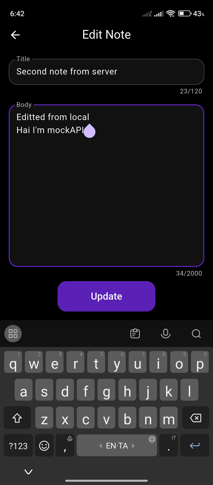

### Edit note

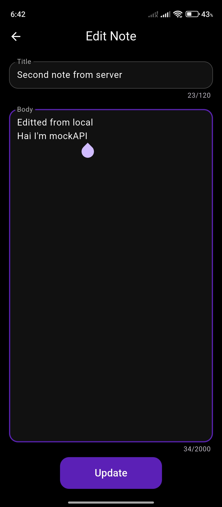

### Conflict - Both server and local editted the same note after last sync

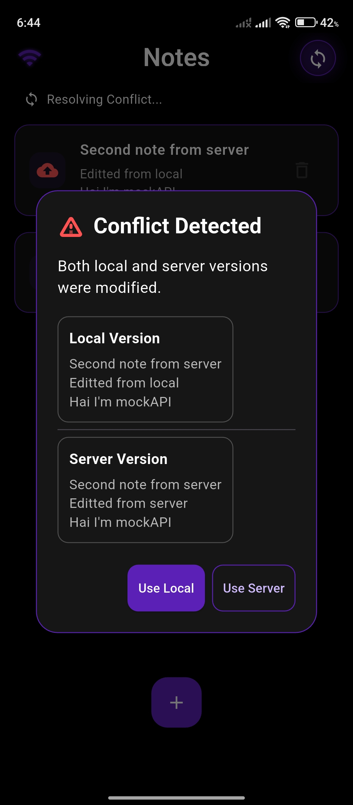

### Conflict - Local editted and server deleted the same note after last sync

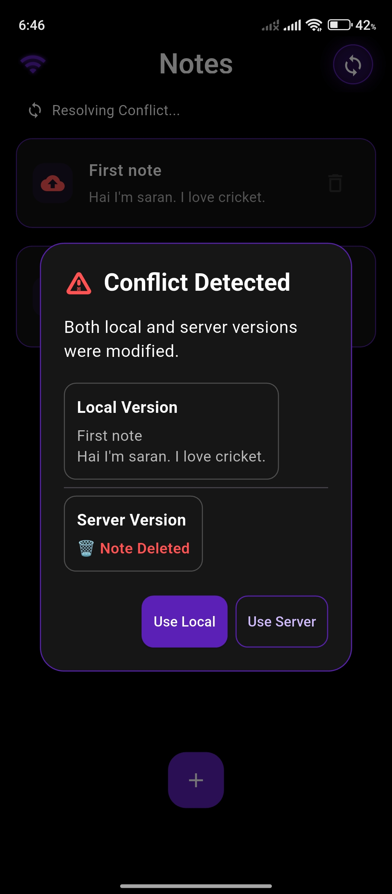

### Syncing

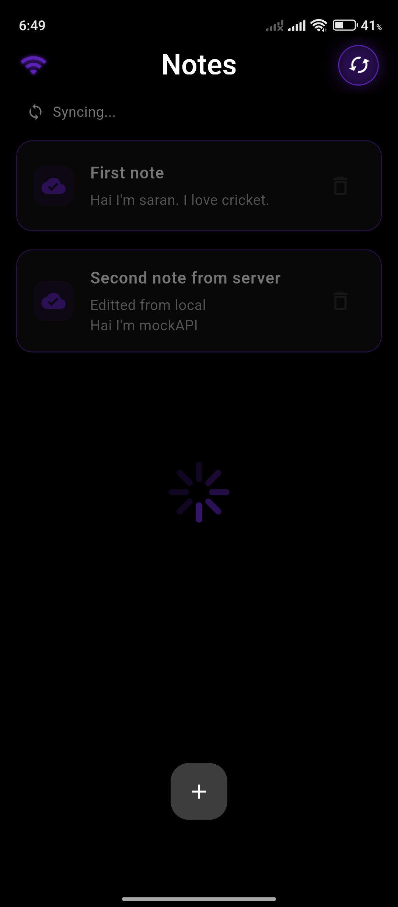

### Delete note

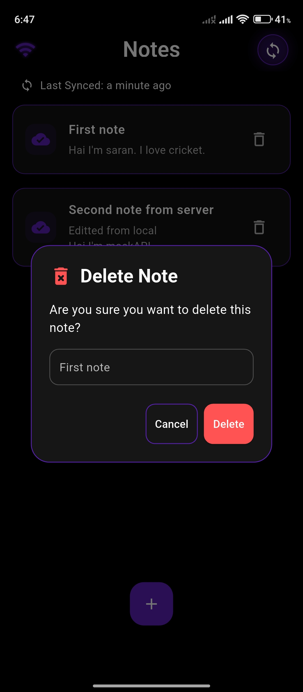

## Responsiveness

### Tablet view

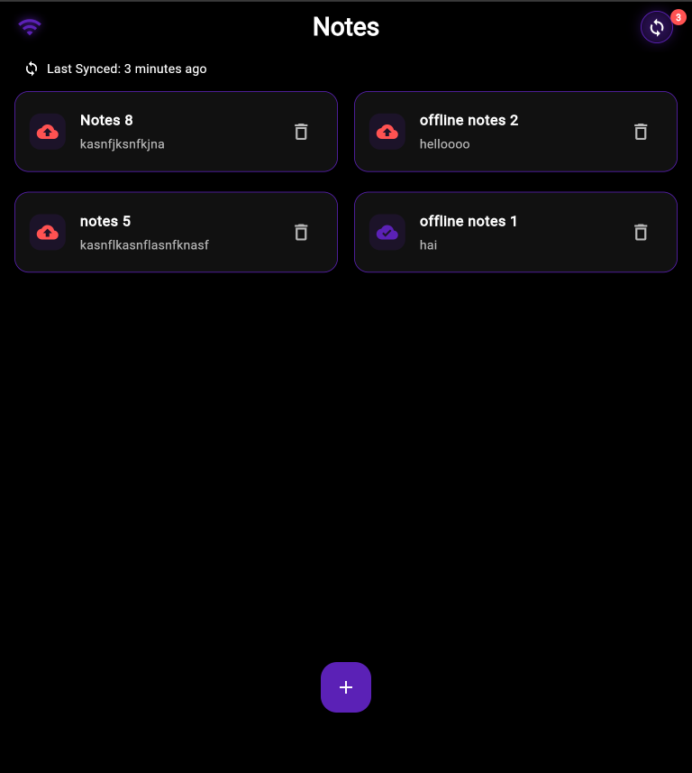

### Desktop view

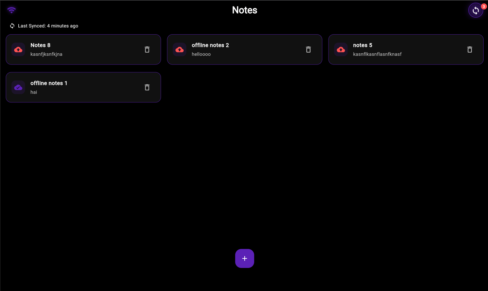
